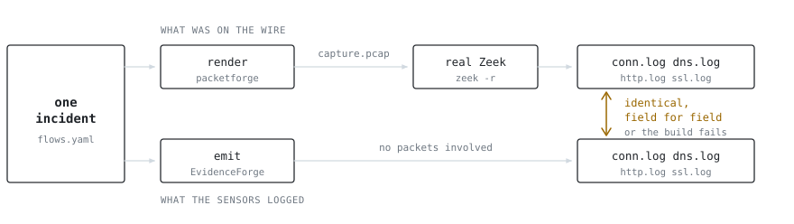
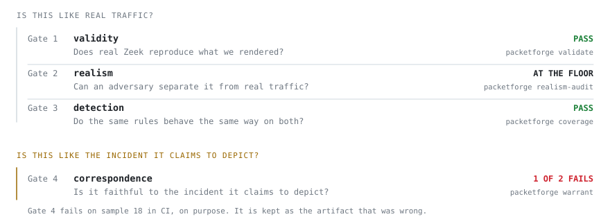

# PacketForge

**Synthetic packet captures with an answer key, for testing detections the way you test code.**

[](https://github.com/peterhanily/PacketForge/actions/workflows/ci.yml)

PacketForge renders the packets an attack would have put on the wire, weaves them into ordinary
background traffic for a network you choose, and hands you three things: the capture, the exact
Zeek logs it produces, and a labelled list of which flows were the attack. Same inputs, same
bytes, every time.

> [!IMPORTANT]
> Everything here is synthetic and inert. Nothing in a capture can execute, and no address or
> domain in one points at anything real. See [`SECURITY.md`](SECURITY.md).

## Make a capture

```console
$ packetforge scenario --env office --attack -o incident.pcap
wrote incident.pcap: 214 flows (office, link=ethernet)
wrote incident.GROUND_TRUTH.md — 5 ATT&CK stages

$ zeek -r incident.pcap && ls *.log
conn.log        kerberos.log       smb_mapping.log
dhcp.log        ldap_search.log    smtp.log
dns.log         ldap.log           ssh.log
files.log       ntp.log            ssl.log
http.log        packet_filter.log  x509.log
```

An office network going about its day, with a five-stage intrusion running through it.
`incident.GROUND_TRUTH.md` names those five flows, the ATT&CK technique each one maps to, and the
signal each should trip. The capture opens in Wireshark, and every log above was written by real
Zeek reading the capture, not by PacketForge asserting anything.

Run it again and you get the same file, byte for byte:

```console
$ packetforge scenario --env office --attack -o again.pcap
$ shasum -a 256 incident.pcap again.pcap
3a73941d159ef04d83d7c1747c724f17aa2ac25fe8f535a80b42b4e2c6f9e3ee  incident.pcap
3a73941d159ef04d83d7c1747c724f17aa2ac25fe8f535a80b42b4e2c6f9e3ee  again.pcap
```

That is the property a test fixture needs and a hand-built capture cannot offer.

## Gate a rule in CI

A fixture renders its attack twice: once with the intrusion, and once from the same seed with no
intrusion at all. A rule has to fire on the first and stay quiet on the second.

```python
from packetforge.detection_ci import packetforge_fixture

MY_RULES = "rules/ad.rules"

def test_kerberoast_rule():
    fx = packetforge_fixture("kerberoasting", env="office", seed=7)
    assert fx.fires(MY_RULES)            # it catches the technique
    assert fx.quiet_on_benign(MY_RULES)  # and not the ordinary AD traffic around it
```

```console
$ pytest tests/detections -q
1 passed in 2.9s
```

The rendered fixture also carries the Zeek logs, so log-based rules (Sigma, Splunk, Elastic) grade
against `conn.log` and `kerberos.log` the same way. Full walkthrough, including export to
[`suricata-verify`](https://github.com/OISF/suricata-verify) and a GitHub Actions job:
[`docs/detection-ci.md`](docs/detection-ci.md).

## Install

```bash
pip install git+https://github.com/peterhanily/PacketForge
```

Python 3.9 or newer. Generating captures needs nothing else.

Validating them needs tools PacketForge does not bundle, because the point is that somebody
else's parser agrees. [Zeek](https://zeek.org) and [tshark](https://tshark.dev) run the round-trip
gate, [Suricata](https://suricata.io) runs the detection commands, and the realism audit needs the
`realism` extra:

```bash
pip install "packetforge[realism] @ git+https://github.com/peterhanily/PacketForge"
```

Anything missing is skipped and reported as skipped, never faked.

To work on it:

```bash
git clone https://github.com/peterhanily/PacketForge && cd PacketForge
pip install -e '.[dev,realism]'
pytest -q
```

## Why the labels can be trusted

<picture>
  <source media="(prefers-color-scheme: dark)" srcset="docs/img/consistency-dark.svg">
  
</picture>

Two things come out of one description of an incident: the packets, and the log rows that incident
should produce. Neither is derived from the other, so they cannot drift apart on a port, a
hostname or a byte count. Then Zeek reads the capture back, and its logs are compared against the
expected rows, field by field.

Any difference is a bug rather than a matter of taste. The check runs on every commit, over
freshly rendered captures, against real Zeek, tshark and Suricata:

```console
$ packetforge validate flows/c2_beacon.yaml
PASS  (83 packets, 6/6 flows matched)
  zeek weird=0 reporter=0  tshark errors=0 warnings=0
```

## How the claims are graded

Four questions, four commands, four published answers. Three pass. The fourth fails on a capture
that still ships.

<picture>
  <source media="(prefers-color-scheme: dark)" srcset="docs/img/gates-dark.svg">
  
</picture>

Gates 1 to 3 are all versions of one question, *is this like real traffic*, and the answers are in
[`docs/validation.md`](docs/validation.md): captures parse clean, ambient traffic
sits about as far from a real capture as two real captures sit from each other, and detections
behave the same way on both sides.

Gate 4 asks something the first three cannot. Two of the shipped samples reconstruct a real,
publicly disclosed incident from its participants' own write-ups, and for those there is no ground
truth, because nobody ran it. `packetforge warrant` checks each rendered flow against the source
claim that licenses it, and marks every field as observed, judgement or fabricated.

Sample 18 was built from two disclosure posts that published no network indicators at all. Four
days later a full technical post-mortem landed. Scored against it, the capture got one technique
right, two roughly right, four wrong, and missed eleven. It still ships, unchanged, and CI asserts
that it still fails Gate 4, because that is what it is evidence for: a capture can pass every
mechanical check and still be a fabrication.
[`docs/exploitgym-postmortem-delta.md`](docs/exploitgym-postmortem-delta.md) is the scoring;
[`docs/correspondence.md`](docs/correspondence.md) is how Gate 4 works.

## What it renders

| Surface | What ships |
|---|---|
| **9 environments** | `office` `home` `ot` `aws-vpc` `azure-vnet` `gcp-vpc` `oci-vcn` `cloud` `k8s`. Each fixes the address plan, resolver, vendor MAC prefixes, host OS mix, ambient service mix and capture link type. |
| **26 attacks** | Kerberoasting, AS-REP roasting, DCSync, LLMNR poisoning, the BZAR lateral-movement pack, ransomware, DNS and DoH tunnelling, cloud metadata credential theft, Kubernetes lateral movement, and more. Each carries its ATT&CK technique and its expected signal. |
| **23 protocols** | Rendered faithfully enough that real Zeek reads the fields back into its own logs. Across the shipped samples that is 21 distinct Zeek log types, from `conn.log` to `kerberos.log`, `dce_rpc.log`, `ntlm.log` and `modbus.log`. |
| **4 capture modes** | The same incident seen from an edge TAP, a core SPAN, a host `tcpdump`, or a cloud traffic mirror. Plus IPv4 fragmentation, and a `realistic` texture that adds jitter, retransmits and duplicate ACKs. |
| **5 evasions** | Domain fronting, JA3 rotation, port hopping, slow-and-low, DNS label depth. `packetforge robustness` measures what each one costs a rule. |

`packetforge list-envs`, `list-attacks` and `list-evasions` print the live sets.
[`docs/capabilities.md`](docs/capabilities.md) is the full map.

## Sample captures

19 scenarios in [`samples/`](samples/), each with the Zeek logs it produces and, where an attack
was actually executed, the answer key for it. Nothing to install to read them.

| Sample | What it shows |
|---|---|
| [01 Kerberoasting in AD](samples/01-kerberoasting-in-ad/) | RC4 service tickets hiding inside benign AES Kerberos. The downgrade is visible in `kerberos.log`. |
| [05 BZAR lateral movement](samples/05-bzar-lateral-movement/) | PsExec-shaped service creation over `\svcctl`, matched against a real capture, and inert by construction. |
| [09 Kubernetes cluster lateral](samples/09-k8s-cluster-lateral/) | Pod-to-pod movement, shipped both directly and as a VXLAN traffic mirror sees it. |
| [15 Multi-vantage](samples/15-multi-vantage/) | One incident, three sensors, side by side. |
| [18](samples/18-openai-hf-exploitgym/) and [19](samples/19-openai-hf-exploitgym-v2/) | The same real incident reconstructed twice, from sources four days apart. |

## Command map

| To | Use |
|---|---|
| Make a capture | `scenario` `compile` `bundle` `report` |
| Check a capture | `validate` `eval` `crossval` `warrant` |
| Grade a detection | `detect` `coverage` `fp-benchmark` `sigma` `robustness` `corpus-build` `corpus-verify` |
| Measure realism | `realism-audit` `realism-scorecard` `realism-detection` `trinity` `blind-panel` |
| Work with real data | `ef-roundtrip` `transfer-proof` `malware-transfer` |

`scripts/demo.sh` runs one capture through most of them in under a minute.

## What this is not

- **It is not a source of threat intelligence.** Indicators are invented. Nothing here belongs in
  a blocklist or an intelligence platform.
- **Encrypted payloads are opaque.** TLS handshakes are real, down to the certificate chain, but
  application data is sized filler. No HTTP/2 frames, no QUIC.
- **IPv6 covers TCP.** UDP renderers and ICMP are IPv4 only.
- **The OT environment is thin.** Modbus is rendered properly; the S7 and DNP3 ambient services
  have no renderer yet and carry no application bytes.
- **The cloud environments are unvalidated against real traffic.** No public cloud capture exists
  to baseline them against, which is a gap in the evidence rather than a search that came up
  empty. See [`docs/appendix/cloud-baselines.md`](docs/appendix/cloud-baselines.md).
- **A large IOC ruleset will catch almost nothing here, by design.** ET Open finds close to zero
  of these attacks because the indicators are fictional. These captures are for testing
  behavioural detection, not IOC feeds.
- **`packetforge eval` is a floor, not a verdict.** It checks for the absence of obvious tells.
  The realism question is answered in [`docs/validation.md`](docs/validation.md).

## Where this came from

PacketForge exists because of
[EvidenceForge issue #332](https://github.com/Cisco-Talos/EvidenceForge/issues/332), which asked
whether realistic, consistent synthetic PCAPs were feasible alongside EvidenceForge's synthetic
logs. It was built to answer that question, and `packetforge ef-roundtrip` still ingests a real
EvidenceForge run and diffs its own Zeek output against EvidenceForge's logs. Thanks to David
Bianco and the EvidenceForge project at Cisco Talos for the incident model and for the question.

This is a personal project and an experiment. It is **not** affiliated with, endorsed by, or
authorised by Cisco, Cisco Talos, the EvidenceForge maintainers, Hugging Face, OpenAI, JFrog,
Modal, Tailscale, or any other organisation named anywhere in this repository. Company and product
names identify what a sample depicts and belong to their owners.

Every capture here is synthetic. Samples 18 and 19 reconstruct a real, publicly disclosed incident
from its participants' own accounts; every packet in them is fabricated, and each ships a manifest
saying which parts rest on a cited source and which were invented. If you represent an
organisation named in one and think it is unfair or should not exist, the contact address is in
[`SECURITY.md`](SECURITY.md).

## Documentation

[`docs/README.md`](docs/README.md) is the map. The short version:
[concepts](docs/concepts.md) for the vocabulary,
[capabilities](docs/capabilities.md) for what it renders,
[detection CI](docs/detection-ci.md) for putting it in a pipeline,
[validation](docs/validation.md) and [correspondence](docs/correspondence.md) for how the claims
are checked, [inert by construction](docs/inert-by-construction.md) for why it is safe to run, and
[DESIGN](docs/DESIGN.md) for how it is built.

MIT licensed, to keep a future merge into EvidenceForge frictionless.
