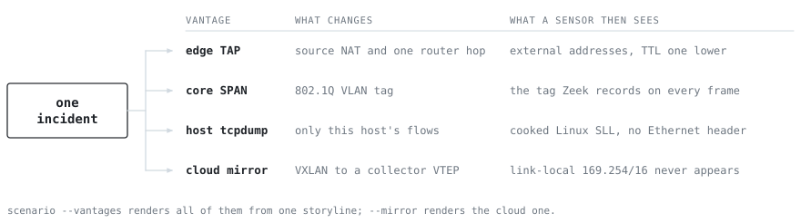

# Capabilities

What PacketForge renders today, and the counts the rest of this tree refers back to rather than
restating. The live sets come from the `list-envs`, `list-attacks`, `list-evasions` and
`list-families` subcommands. Zeek, tshark and Suricata are external tools, not Python
dependencies; install the package with `pip install git+https://github.com/peterhanily/PacketForge`.

## Protocols

23 protocols have a protocol-specific renderer. Each renderer emits the bytes its wire format
calls for and declares what a correct parser should read back, so real Zeek can be diffed against
that declaration flow by flow. Two further renderers emit opaque transport shells.

| Family | Protocols | Zeek logs |
|---|---|---|
| Web and TLS | HTTP, TLS 1.2/1.3 | `http.log`, `ssl.log`, `x509.log`, `files.log`, `pe.log` |
| Name resolution | DNS, LLMNR, NBT-NS, mDNS | `dns.log` |
| Active Directory | Kerberos, LDAP, SMB2/3, DCE-RPC | `kerberos.log`, `ldap.log`, `ldap_search.log`, `smb_mapping.log`, `smb_files.log`, `ntlm.log`, `dce_rpc.log` |
| Mail | SMTP, POP3, IMAP | `smtp.log`, `conn.log` |
| Infrastructure | DHCP, NTP, SNMP, RADIUS, SSH, FTP, SIP, IRC, ICMP | `dhcp.log`, `ntp.log`, `snmp.log`, `radius.log`, `ssh.log`, `ftp.log`, `sip.log`, `irc.log`, `conn.log` |
| OT | Modbus/TCP | `modbus.log` |
| Transport shells | opaque TCP, opaque UDP | `conn.log` |

IPv6 covers TCP only: every UDP renderer and ICMP emit IPv4, so a capture is not dual-stack. There
is no QUIC and no HTTP/2 or HTTP/3 framing; TLS may advertise `h2`, but sends sized filler.

The TLS renderer takes a client profile, so JA3 and JA4 (two hashes of a ClientHello's ordered
extension and cipher lists) are inputs rather than library accidents, as are GREASE and ALPN. The
DCE-RPC renderer binds nine MS-RPC interfaces (svcctl, atsvc, ITaskSchedulerService, srvsvc, samr,
winreg, IWbemServices, epmapper, drsuapi) over SMB named pipes or raw `ncacn_ip_tcp` on 135, at a
chosen opnum: the integer naming a method in an RPC interface, and a field `dce_rpc.log` records.

### Protocols modelled on top of another renderer

These four are flows built on the renderers above, not renderers of their own.

- **DoH.** A TLS flow to a public resolver on 443 with ALPN `h2`. There is no HTTP/2 framing and
  no encoded DNS message, so the signal is the destination plus the beacon cadence.
- **DoT.** A TLS flow on 853 with ALPN `dot`, which Zeek records as `ssl.log` `next_protocol`.
- **WinRM.** An HTTP `POST /wsman` to port 5985 with the `Microsoft WinRM Client` User-Agent and
  an `application/soap+xml` content type. The SOAP bodies are sized filler.
- **RDP.** An opaque TCP flow on 3389 whose only bytes are a literal X.224 Connection Request and
  Confirm. The request holds the `mstshash` cookie, enough for an `rdp.log` row naming the
  attempted user, and nothing more.

### Opaque shells

An opaque shell is a flow with correct L3 and L4 structure, a real `conn_state` (Zeek's short code
for how a connection ended) and a byte count, but no application payload. Zeek binds analyzers by
port, so filler bytes on a dissected port land in `weird.log`. The alternative is a half-parsed
guess at a binary protocol: right in a hex dump, wrong in every field a detection reads.

Across the shipped samples, real Zeek writes 21 distinct log types: `conn.log`, `dns.log`,
`http.log`, `ssl.log`, `x509.log`, `files.log`, `pe.log`, `smtp.log`, `ftp.log`, `ssh.log`,
`ntp.log`, `dhcp.log`, `kerberos.log`, `ldap.log`, `ldap_search.log`, `ntlm.log`,
`smb_mapping.log`, `smb_files.log`, `dce_rpc.log`, `modbus.log` and `tunnel.log`.

## Environments

9 environments, each fixing the address plan, resolver, vendor MAC OUI, host-OS mix, ambient
service mix and link type. A vantage is the sensor position: a SPAN port (a switch port mirroring
other ports), a TAP (an inline splitter), or a host running `tcpdump`, which yields cooked Linux
SLL frames, a pseudo-link layer carrying a direction flag in place of the two MAC addresses.

| Name | Address plan | Resolver | Link and vantage |
|---|---|---|---|
| `office` | 10.10.0.0/16 | 10.10.0.10 | Ethernet, core SPAN |
| `home` | 192.168.1.0/24 | 192.168.1.1 (router) | Ethernet, gateway SPAN |
| `ot` | 192.168.0.0/24 | 192.168.0.1 | Ethernet, cell TAP |
| `aws-vpc` | 172.31.0.0/16 | 172.31.0.2 | Linux SLL, host agent |
| `azure-vnet` | 10.1.0.0/16 | 168.63.129.16 | Linux SLL, host agent |
| `gcp-vpc` | 10.128.0.0/20 | 169.254.169.254 | Linux SLL, host agent |
| `oci-vcn` | 10.0.0.0/16 | 169.254.169.254 | Linux SLL, host agent |
| `cloud` | 10.0.0.0/16 | 10.0.0.2 | Linux SLL, host agent |
| `k8s` | 10.244.0.0/16 | 10.96.0.10 (CoreDNS) | Ethernet, mirror collector |

The `ot` ambient mix is thin: `s7` (port 102) and `dnp3` (port 20000) have no renderer, so both
fall through to opaque TCP with zero application bytes, at 22 of the 66 ambient weight.

## Capture modes

One incident can be projected to several sensor positions at once, which answers whether a
detection fires given where the sensors actually are.

<picture>
  <source media="(prefers-color-scheme: dark)" srcset="img/vantage-dark.svg">
  
</picture>

| Mode | CLI | What it produces |
|---|---|---|
| Multi-vantage | `scenario --vantages` | The same incident from an edge TAP (source-NAT and a router-hop TTL decrement), a core SPAN (802.1Q VLAN tags), and, with `--attack`, the victim's own `tcpdump`. |
| Traffic mirroring | `scenario --mirror` | Each frame encapsulated in VXLAN (a UDP overlay that wraps a whole Ethernet frame) to a collector, which Zeek decapsulates to the inner flows plus a `tunnel.log`. |
| Fragmentation | `scenario --fragment BYTES` | IPv4 fragments at the given size, as a reassembly and IDS-evasion test. Zeek reassembles to the same flows. |
| Texture | `scenario --texture` | `clean` or `realistic`, where realistic adds RTT jitter, retransmits and duplicate ACKs. |
| Volume | `scenario --volume` | `quiet`, `normal`, `busy` or `saturated`, applied as a rate over the requested duration. |

Mirroring excludes link-local 169.254.0.0/16, as AWS and GCP do. IMDS traffic (the instance
metadata service at 169.254.169.254) therefore renders only on an on-host vantage.

5 evasion modifiers apply to a storyline through `scenario --evasion`, which is repeatable:
`dns-depth`, `domain-fronting`, `ja3-randomization`, `port-hopping` and `slow-and-low`.

## Attack library

26 attacks, each carrying its own ground-truth entry and ATT&CK mapping.

| Tactic | Attack | Technique | What it renders |
|---|---|---|---|
| Initial access and C2 | `phishing-intrusion` | T1566.001, T1071.001 | Phishing to C2 to discovery to lateral movement to exfiltration. |
| | `ipv6-c2` | T1071.001 | HTTPS beaconing over IPv6, to test an address-family-blind rule. |
| | `doh-tunnel` | T1071.004, T1572 | DNS-over-HTTPS tunnelling to a public resolver. |
| | `dot-tunnel` | T1071.004, T1572 | DNS-over-TLS tunnelling on 853. |
| Credential access | `kerberoasting` | T1558.003 | One principal requests many RC4 service tickets in a burst. |
| | `asrep-roasting` | T1558.004 | AS-REQs with no pre-auth yield crackable AS-REPs. |
| | `brute-force` | T1110 | SSH password spray against a server. |
| | `rdp-bruteforce` | T1110.001, T1021.001 | RDP username sweep, one attempt per connection. |
| | `dcsync` | T1003.006 | `drsuapi` DRSGetNCChanges from a non-DC host. |
| | `llmnr-poisoning` | T1557.001 | Responder-style AiTM (adversary-in-the-middle) into an inert NTLM capture. |
| | `imds-ssrf` | T1552.005 | Cloud instance-metadata credential theft through SSRF. |
| Discovery | `port-scan` | T1046 | Vertical port scan of an internal host. |
| | `share-discovery` | T1135 | Share enumeration over `\srvsvc`. |
| | `account-discovery` | T1087.002 | Domain account enumeration over `\samr`. |
| Lateral movement and execution | `remote-service` | T1543.003, T1569.002 | Remote service creation over `\svcctl`. |
| | `scheduled-task` | T1053.005 | Remote scheduled-task registration over `\atsvc`. |
| | `wmi-exec` | T1047 | WMI remote execution via `IWbemServices::ExecMethod`. |
| | `admin-share-transfer` | T1021.002, T1570 | Tool transfer to an `ADMIN$` share. |
| | `remote-registry` | T1112 | Remote registry modification over `\winreg`. |
| | `psexec-lateral` | T1021.002, T1543.003 | Share drop and service creation against the same target. |
| | `winrm-lateral` | T1021.006 | WinRM shell lifecycle over WSMan on 5985. |
| | `k8s-lateral` | T1613, T1552.007 | Pod-to-pod movement inside a cluster. |
| Exfiltration and impact | `dns-exfil` | T1048.003 | Many encoded subdomain lookups under one parent. |
| | `cloud-exfil` | T1567.002 | Large HTTPS uploads to a provider bucket. |
| | `ransomware` | T1486 | Recon, C2, then mass SMB file access. |
| | `ddos-syn-flood` | T1499.001, T1498 | Volumetric SYN flood against an internal service. |

Eight form the BZAR pack (BZAR is MITRE's Bro/Zeek ATT&CK-based Analytics and Reporting package):
`share-discovery`, `account-discovery`, `remote-service`, `scheduled-task`, `wmi-exec`,
`admin-share-transfer`, `remote-registry` and `psexec-lateral`. BZAR's own notices fire on the
rendered captures. [`inert-by-construction.md`](inert-by-construction.md) covers why none of this
carries a working payload.

## Outputs

- `scenario`. A composed capture plus a `GROUND_TRUTH.md` and `GROUND_TRUTH.json` answer key
  naming every attack flow and its technique.
- `bundle`. A detection-CI directory holding `capture.pcap`, the Zeek logs real Zeek derived from
  it, the ground truth, and a `manifest.json` recording the flow count, a SHA-256 of the pcap and
  the consistency result. Grade a rule against it without re-deriving anything.
- `report`. A self-contained HTML forensic report for one capture.
- **Detection lab.** `detect`, `coverage`, `fp-benchmark`, `sigma`, `robustness`, `corpus-build`
  and `corpus-verify` score a ruleset against a capture or against the versioned corpus.
- **Realism scoring.** `eval`, `realism-audit`, `trinity`, `realism-detection`, `blind-panel` and
  `realism-scorecard` measure gates 1 to 3, as does the pair `transfer-proof` and
  `malware-transfer`. Methods and numbers: [`validation.md`](validation.md).
- **Cross-validation.** `crossval` runs Zeek, Suricata, tshark and optionally p0f over a capture
  and reports whether they parse it cleanly and agree on its fingerprints. That is a parseability
  result, not a verdict that the traffic is real. p0f is reported as skipped when absent.

### Gate 4 output

`warrant` covers a reconstruction of a real incident, where no ground truth exists because nobody
ran it. It checks a storyline against the claim set that licenses it, then writes `CLAIMS.md` and
`CLAIMS.json` through `--manifest-md` and `--manifest-json`. Those record which source claim
licenses each flow, what is declared unmodelled and why, and what fraction of the capture's
network facts appear in a cited source at all. `--pcapng` carries the same warrant in-band as
per-packet comments, so it survives detachment from the manifest. Samples 18 and 19 ship both
files. Method: [`correspondence.md`](correspondence.md).

### Inert malware families

`list-families` prints six TLS families: `dridex`, `gootkit`, `metasploit_ccs_scanner`,
`metasploit_ssl_scanner`, `ratsnake` and `shadowbeacon`. Four HTTP C2 framework profiles also live
in `c2_fingerprints.py`, but no CLI path reaches them, so only the Python API and tests use them.

19 sample folders under [`../samples/`](../samples/) hold 26 capture files: 24 `.pcap` and
two `.pcapng`. [`detection-ci.md`](detection-ci.md) covers using them as pytest fixtures, and
[`DESIGN.md`](DESIGN.md) covers how the renderers are built.
